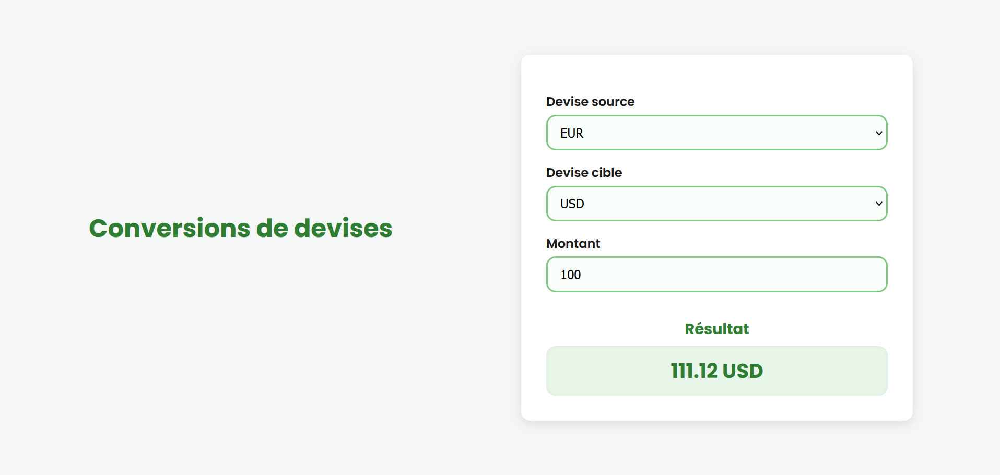

# 💱 TP Conversion de Devises

Ce projet est un convertisseur de devises interactif réalisé dans le cadre d’un TP. Il utilise l'API [ExchangeRate API](https://www.exchangerate-api.com/) pour récupérer les taux de change en temps réel.

---

## 🚀 Fonctionnalités

- ✅ Sélection dynamique des devises (source et cible) via l'API
- ✅ Saisie du montant à convertir
- ✅ Conversion instantanée en temps réel
- ✅ Design responsive et moderne (Google Fonts)
- ✅ Interface simple et intuitive

---

## 🧰 Technologies utilisées

- HTML5
- CSS3
- JavaScript (ES6+)
- [ExchangeRate API](https://www.exchangerate-api.com/)
- [Google Fonts – Poppins](https://fonts.google.com/specimen/Poppins)

---

## 📸 Aperçu

 

---

## 🧠 Auteurs

- 👨‍💻 Réalisé par : Maïssane ABDALLAH

- 🏫 Projet encadré dans le cadre du module Javascript

---

## 📃 Licence

Ce projet est réalisé dans un cadre pédagogique. Reproduction et usage libres à des fins non commerciales.